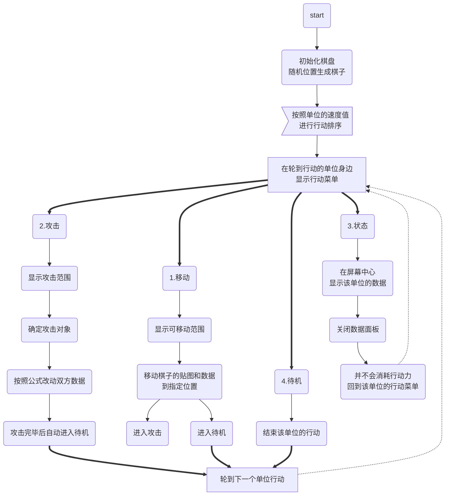

```mermaid
graph TD

    A("start")

    A-->B("<center>初始化棋盘<br>随机位置生成棋子</center>")
    B-->C>"按照单位的速度值<br>进行行动排序"]
    C-->D["在轮到行动的单位身边<br>显示行动菜单"]

    D==>G("1.移动")
    D==>F("2.攻击")  
    D==>H("3.状态")
    D==>E("4.待机")

    F-->FA("显示攻击范围")
    FA-->FB("确定攻击对象")
    FB-->FC("按照公式改动双方数据")
    FC-->FD("攻击完毕后自动进入待机")
    FD==>EB
    
    G-->GA("显示可移动范围")
    GA-->GB("移动棋子的贴图和数据<br>到指定位置")
    GB-->GC("进入攻击")
    GC
    GB-->GD("进入待机")
    GD==>EB
    
    E-->EA("结束该单位的行动")
    EA==>EB["轮到下一个单位行动"]
    EB-.->D

    H-->HA("在屏幕中心<br>显示该单位的数据")
    HA-->HB("关闭数据面板")
    HB-->HC("并不会消耗行动力<br>回到该单位的行动菜单")
    HC-.->D

```